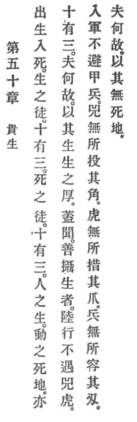

  
[Intangible Textual Heritage](../../index)  [Taoism](../index.md) 
[Index](index)  [Previous](crv055)  [Next](crv057.md) 

------------------------------------------------------------------------

### 50. THE ESTIMATION OF LIFE.

|                    |
|--------------------|
|  |

1\. Abroad in life, home in death.

2\. There are thirteen avenues of life; there are thirteen avenues of
death; on thirteen avenues men that live pass unto the realm of death.

3\. Now, what is the reason? It is because they live life's intensity.

4\. Yea, I understand that one whose life is based on goodness, when
traveling on land will not fall a prey to the rhinoceros or the tiger.
When coming among soldiers, he need not fear arms and weapons. The
rhinoceros finds no place wherein to insert its horn. The tiger finds no
place wherein to put his claws. Weapons find no place wherein to thrust
their blades. The reason is that he does not belong to the realm of
death.

------------------------------------------------------------------------

[Next: 51. Nursing Virtue](crv057.md)
