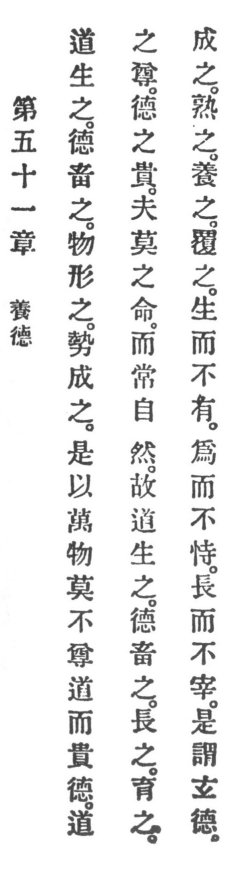

  
[Intangible Textual Heritage](../../index)  [Taoism](../index.md) 
[Index](index)  [Previous](crv056)  [Next](crv058.md) 

------------------------------------------------------------------------

### 51. NURSING VIRTUE.

|                    |
|--------------------|
|  |

1\. Reason quickens all creatures. Virtue feeds them. Reality shapes
them. The forces complete them. Therefore p.
109 among the ten thousand things there is none that does not
esteem Reason and honor virtue.

2\. Since the esteem of Reason and the honoring of virtue is by no one
commanded, it is forever spontaneous.

3\. Therefore it is said that Reason quickens all creatures, while
virtue feeds them, raises them, nurtures them, completes them, matures
them, rears them, and protects them.

4\. To quicken but not to own, to make but not to claim, to raise but
not to rule, this is called profound virtue.

------------------------------------------------------------------------

[Next: 52. Returning to the Origin](crv058.md)
