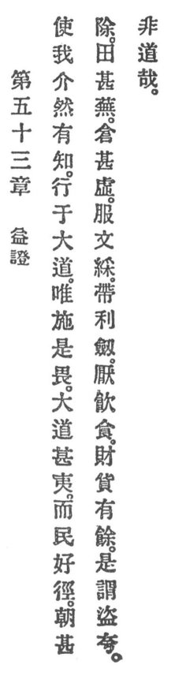

  
[Intangible Textual Heritage](../../index)  [Taoism](../index.md) 
[Index](index)  [Previous](crv058)  [Next](crv060.md) 

------------------------------------------------------------------------

### 53. GAINING INSIGHT.

|                    |
|--------------------|
|  |

1\. If I have ever so little knowledge, I shall walk in the great
Reason. It is but expansion that I must fear.

2\. The great Reason is very plain, but people are fond of by-paths.

3\. When the palace is very splendid, the fields are very weedy and
granaries very empty.

4\. To wear ornaments and gay clothes, to carry sharp swords, to be
excessive in drinking and eating, to have a redundance of costly
articles, this is the pride of robbers.

5\. Surely, this is un-Reason.

------------------------------------------------------------------------

[Next: 54. The Cultivation of Inituition](crv060.md)
