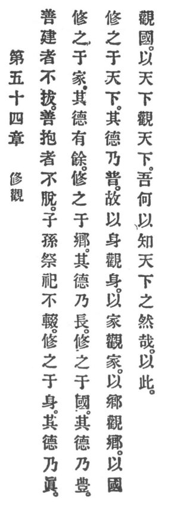

  
[Intangible Textual Heritage](../../index)  [Taoism](../index.md) 
[Index](index)  [Previous](crv059)  [Next](crv061.md) 

------------------------------------------------------------------------

p. 111

### 54. THE CULTIVATION OF INTUITION.

|                    |
|--------------------|
|  |

1\. "What is well planted is not uprooted;  
What's well preserved can not be looted!"

2\. By sons and grandsons the sacrificial celebrations shall not cease.

3\. Who cultivates Reason in his person, his virtue is genuine.

Who cultivates it in his house, his virtue is overflowing.

Who cultivates it in his township, his virtue is lasting.

Who cultivates it in his country, his virtue is abundant.

Who cultivates it in the world, his virtue is universal.

4\. Therefore,

By one's person one tests persons.

By one's house one tests houses.

By one's township one tests townships.

By one's country one tests countries.

By one's world one tests worlds.

5\. How do I know that the world is such? Through IT.

------------------------------------------------------------------------

[Next: 55. The Signet of the Mysterious](crv061.md)
