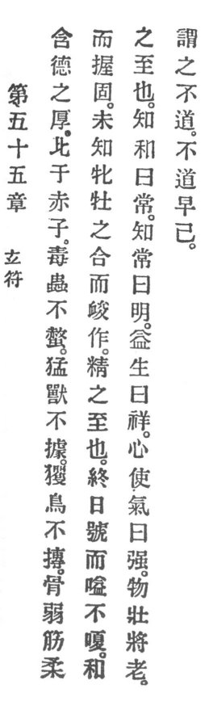

  
[Intangible Textual Heritage](../../index)  [Taoism](../index) 
[Index](index)  [Previous](crv060)  [Next](crv062) 

------------------------------------------------------------------------

p. 112

### 55. THE SIGNET OF THE MYSTERIOUS.

|                    |
|--------------------|
|  |

1\. He who possesses virtue in all its solidity is like unto a little
child.

2\. Venomous reptiles do not sting him, fierce beasts do not seize him.
Birds of prey do not strike him. His bones are weak, his sinews tender,
but his grasp is firm. He does not yet know the relation between male
and female, but his virility is strong. Thus his metal grows to
perfection. A whole day he might cry and sob without growing hoarse.
This shows the perfection of his harmony.

3\. To know the harmonious is called the eternal. To know the eternal is
called enlightenment.

4\. To increase life is called a blessing, and heart-directed vitality
is called strength, but things vigorous are about to grow old and I call
this un-Reason.

5\. Un-Reason soon ceases!

------------------------------------------------------------------------

[Next: 56. The Virtue of the Mysterious](crv062)
