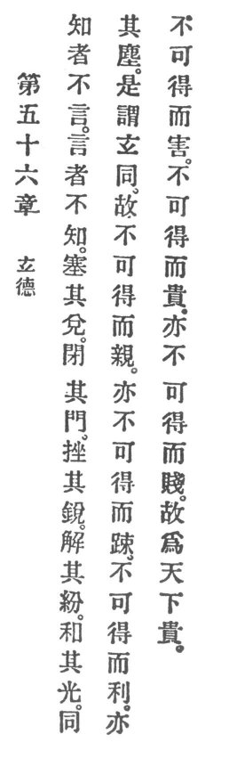

  
[Intangible Textual Heritage](../../index)  [Taoism](../index.md) 
[Index](index)  [Previous](crv061)  [Next](crv063.md) 

------------------------------------------------------------------------

### 56. THE VIRTUE OF THE MYSTERIOUS.

|                    |
|--------------------|
|  |

1\. One who knows does not talk. One who talks does not know. Therefore
the sage keeps his mouth shut and his sense-gates closed.

p. 113

2\. "He will blunt his own sharpness, His own tangles adjust; He will
dim his own radiance, And be one with his dust."

3\. This is called profound identification.

4\. Thus he is inaccessible to love and also inaccessible to enmity. He
is inaccessible to profit and inaccessible to loss. He is also
inaccessible to favor and inaccessible to disgrace. Thus he becomes
world-honored.

------------------------------------------------------------------------

[Next: 57. Simplicity in Habits](crv063.md)
