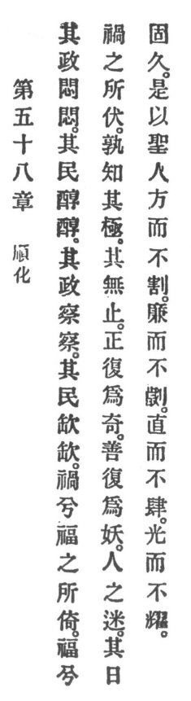

  
[Intangible Textual Heritage](../../index)  [Taoism](../index.md) 
[Index](index)  [Previous](crv063)  [Next](crv065.md) 

------------------------------------------------------------------------

### 58. ADAPTATION TO CHANGE.

|                    |
|--------------------|
|  |

1\. Whose government is unostentatious, quite unostentatious, his people
will be prosperous, quite prosperous. Whose government is prying, quite
prying, his people will be needy, quite needy.

2\. Misery, alas! rests upon happiness. Happiness, alas! underlies
misery. But who foresees the catastrophe? It will not be prevented!

3\. What is ordinary becomes again extraordinary. What is good becomes
again unpropitious. This bewilders people, and it happens constantly
since times immemorial.

p. 115

4\. Therefore the holy man is square but not sharp, strict but not
obnoxious, upright but not restraining, bright but not dazzling.

------------------------------------------------------------------------

[Next: 59. Hold Fast to Reason](crv065.md)
