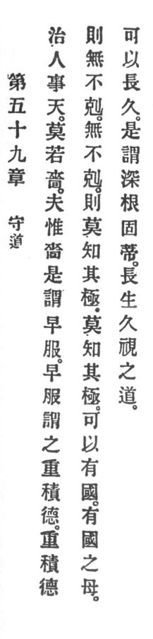

  
[Intangible Textual Heritage](../../index)  [Taoism](../index.md) 
[Index](index)  [Previous](crv064)  [Next](crv066.md) 

------------------------------------------------------------------------

### 59. HOLD FAST TO REASON.

|                    |
|--------------------|
|  |

1\. To govern the people is the affair of heaven and there is nothing
like thrift.

Now consider that thrift is said to come from early practice.

2\. By early practice it is said that we can accumulate an abundance of
virtue. If one accumulates an abundance of virtue then there is nothing
that can not be overcome.

3\. When nothing can not be overcome then no one knows his limit. When
no one knows his limit one can have possession of the commonwealth.

4\. Who has possession of the commonwealth's mother \[thrift\] may last
and abide.

5\. This is called the possession of deep roots and of a staunch stem.
To life, to everlastingness, to comprehension, this is the way.

------------------------------------------------------------------------

[Next: 60. How to Maintain One's Place](crv066.md)
