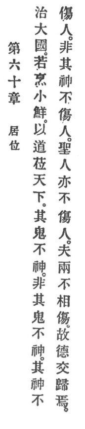

  
[Intangible Textual Heritage](../../index)  [Taoism](../index) 
[Index](index)  [Previous](crv065)  [Next](crv067) 

------------------------------------------------------------------------

p. 116

### 60. HOW TO MAINTAIN ONE'S PLACE.

|                    |
|--------------------|
|  |

1\. Govern a great country as you would fry small fish: \[neither gut
nor scale them.\]

2\. If with Reason the empire is managed, its ghosts will not spook. Not
only will its ghosts not spook, but its gods will not harm the people.
Not only will its gods not harm the people, but neither will its holy
men harm the people. Since neither will do harm, therefore their virtues
will be combined.

------------------------------------------------------------------------

[Next: 61. The Virtue of Humility](crv067)
