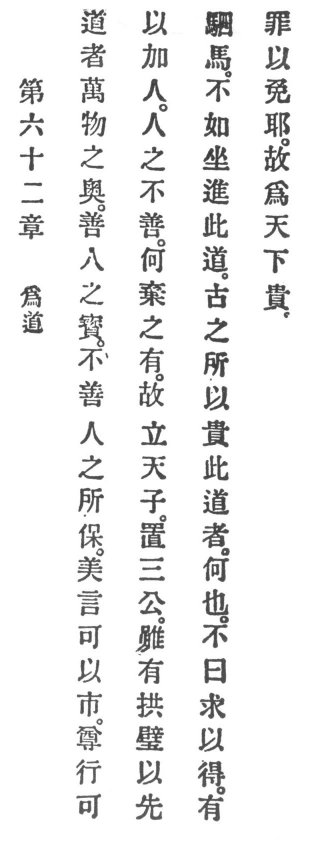

  
[Intangible Textual Heritage](../../index)  [Taoism](../index.md) 
[Index](index)  [Previous](crv067)  [Next](crv069.md) 

------------------------------------------------------------------------

### 62. PRACTISE REASON.

|                    |
|--------------------|
|  |

1\. The man of Reason is the ten thousand creatures' refuge, the good
man's wealth, the bad man's stay.

2\. With beautiful words one can sell. With honest conduct one can do
still more with the people.

3\. If a man be bad, why should he be thrown away? Therefore, an emperor
was elected and three ministers appointed; but better than holding
before one's face the jade table \[of the ministry\] and riding with
four horses, is sitting still and propounding the eternal Reason.

4\. Why do the ancients prize this Reason? Is it not, say, because when
sought p. 118 it is obtained and the sinner
thereby can be saved? Therefore it is world-honored.

------------------------------------------------------------------------

[Next: 63. Consider Beginnings](crv069.md)
