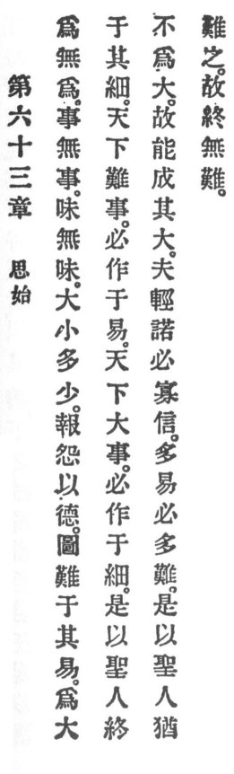

  
[Intangible Textual Heritage](../../index)  [Taoism](../index.md) 
[Index](index)  [Previous](crv068)  [Next](crv070.md) 

------------------------------------------------------------------------

### 63. CONSIDER BEGINNINGS.

|                    |
|--------------------|
|  |

1\. Assert non-assertion.

Practise non-practice.

Taste the tasteless.

Make great the small.

Make much the little.

2\. Requite hatred with virtue.

3\. Contemplate a difficulty when it is easy. Manage a great thing when
it is small.

4\. The world's most difficult undertakings necessarily originate while
easy, and the world's greatest undertakings necessarily originate while
small.

5\. Therefore the holy man to the end does not venture to play the
great, and thus he can accomplish his greatness.

6\. Rash promises surely lack faith, and many easy things surely involve
in many difficulties.

7\. Therefore, the holy man regards everything as difficult, and thus to
the end encounters no difficulties.

------------------------------------------------------------------------

[Next: 64. Mind the Insignificant](crv070.md)
