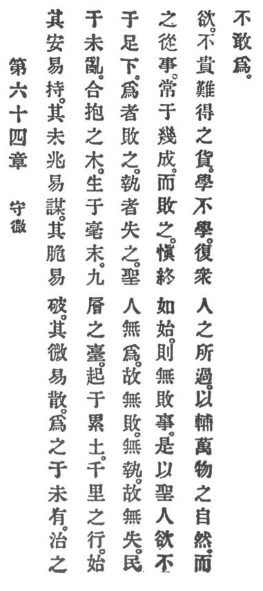

  
[Intangible Textual Heritage](../../index)  [Taoism](../index) 
[Index](index)  [Previous](crv069)  [Next](crv071) 

------------------------------------------------------------------------

p. 119

### 64. MIND THE INSIGNIFICANT.

|                    |
|--------------------|
|  |

1\. What is still at rest is easily kept quiet. What has not as yet
appeared is easily prevented. What is still feeble is easily broken.
What is still scant is easily dispersed.

2\. Treat things before they exist. Regulate things before disorder
begins. The stout tree has originated from a tiny rootlet. A tower of
nine stories is raised by heaping up \[bricks of\] clay. A thousand
miles' journey begins with a foot.

3\. He that makes mars. He that grasps loses.

The holy man does not make; therefore he mars not. He does not grasp;
therefore he loses not. The people when undertaking an enterprise are
always near completion, and yet they fail.

4\. Remain careful to the end as in the beginning and you will not fail
in your enterprise.

5\. Therefore the holy man desires to be desireless, and does not prize
articles difficult to obtain. He learns, not to p.
120 be learned, and seeks a home where multitudes of people pass
by.

6\. He assists the ten thousand things in their natural development, but
he does not venture to interfere.

------------------------------------------------------------------------

[Next: 65. The Virtue of Simplicity](crv071)
