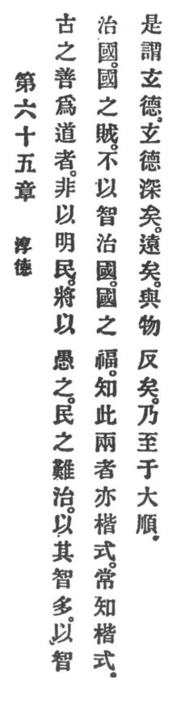

  
[Intangible Textual Heritage](../../index)  [Taoism](../index) 
[Index](index)  [Previous](crv070)  [Next](crv072) 

------------------------------------------------------------------------

### 65. THE VIRTUE OF SIMPLICITY.

|                    |
|--------------------|
|  |

1\. The ancients who were well versed in Reason did not thereby
enlighten the people; they intended thereby to make them simple-hearted.

2\. If people are difficult to govern, it is because they are too smart.
To govern the country with smartness is the country's curse. To govern
the country without smartness is the country's blessing. He who knows
these two things is also a model \[like the ancients\]. Always to know
the model is called profound virtue.

3\. Spiritual virtue, verily, is profound. Verily, it is far-reaching.
Verily, it is to everything reverse. But then it will procure great
recognition.

------------------------------------------------------------------------

[Next: 66. Putting Oneself Behind](crv072)
