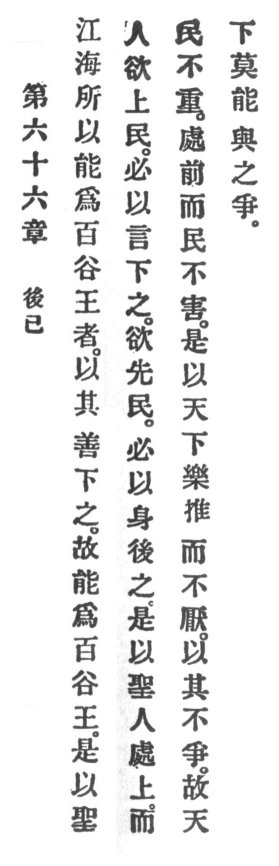

  
[Intangible Textual Heritage](../../index)  [Taoism](../index) 
[Index](index)  [Previous](crv071)  [Next](crv073) 

------------------------------------------------------------------------

p. 121

### 66. PUTTING ONESELF BEHIND.

|                    |
|--------------------|
|  |

1\. That rivers and oceans can of the hundred valleys be kings is due to
their excelling in lowliness. Thus they can of the hundred valleys be
the kings.

2\. Therefore the holy man, when anxious to be above the people, must in
his words keep underneath them. When anxious to lead the people, he must
with his person keep behind them.

3\. Therefore the holy man dwells above, but the people are not
burdened. He is ahead, but the people suffer no harm.

4\. Therefore the world rejoices in exalting him and does not tire.
Because he strives not, no one in the world will strive with him.

------------------------------------------------------------------------

[Next: 67. The Three Treasures](crv073)
