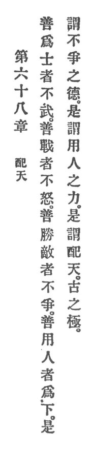

  
[Intangible Textual Heritage](../../index)  [Taoism](../index.md) 
[Index](index)  [Previous](crv073)  [Next](crv075.md) 

------------------------------------------------------------------------

### 68. COMPLYING WITH HEAVEN.

|                    |
|--------------------|
|  |

1\. He who excels as a warrior is not warlike. He who excels as a
fighter is not wrathful. He who excels in conquering the enemy does not
strive. He who excels in employing men is lowly.

2\. This is called the virtue of not-striving. This is called utilizing
men's p. 123 ability. This is called
complying with heaven-since olden times the highest.

------------------------------------------------------------------------

[Next: 69. The Function of the Mysterious](crv075.md)
