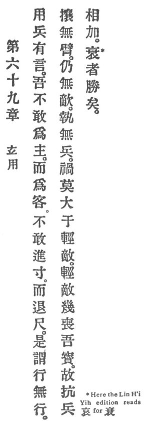

  
[Intangible Textual Heritage](../../index)  [Taoism](../index.md) 
[Index](index)  [Previous](crv074)  [Next](crv076.md) 

------------------------------------------------------------------------

### 69. THE FUNCTION OF THE MYSTERIOUS.

|                    |
|--------------------|
|  |

1\. A military expert used to say: 'I dare not act as host \[who takes
the initiative\] but act as guest \[with reserve\]. I dare not advance
an inch, but I withdraw a foot."

2\. This is called marching without marching, threatening without arms,
charging without hostility, seizing without weapons.

3\. No greater misfortune than making light of the enemy! When we make
light of the enemy, it is almost as though we had lost our
treasure--\[compassion\].

4\. Thus, if matched armies encounter one another, the one who does so
in sorrow is sure to conquer.

------------------------------------------------------------------------

[Next: 70. Difficult to Understand](crv076.md)
