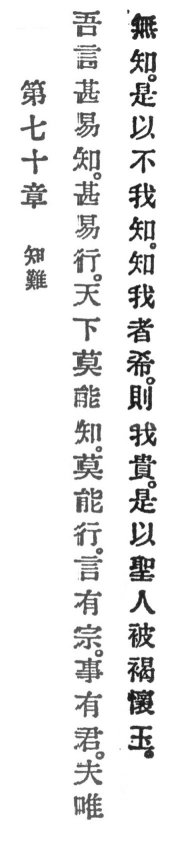

  
[Intangible Textual Heritage](../../index)  [Taoism](../index) 
[Index](index)  [Previous](crv075)  [Next](crv077) 

------------------------------------------------------------------------

### 70. DIFFICULT TO UNDERSTAND.

|                    |
|--------------------|
|  |

1\. My words are very easy to understand and very easy to practise, but
in the world no one can understand, no one can practise them.

p. 124

2\. Words have an ancestor; Deeds have a master \[viz., Reason\]. Since
he is not understood, therefore I am not understood. Those who
understand me are few, and thus I am distinguished.

3\. Therefore the holy man wears wool, and hides in his bosom his
jewels.

------------------------------------------------------------------------

[Next: 71. The Disease of Knowledge](crv077)
