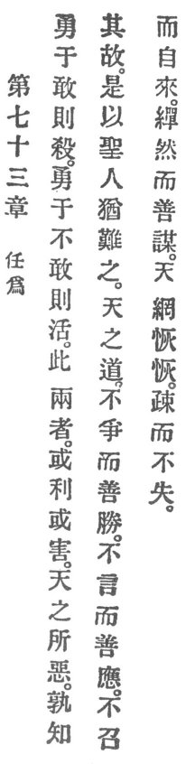

  
[Intangible Textual Heritage](../../index)  [Taoism](../index.md) 
[Index](index)  [Previous](crv078)  [Next](crv080.md) 

------------------------------------------------------------------------

### 73. DARING TO ACT.

|                    |
|--------------------|
|  |

1\. Courage, if carried to daring, leads to death; courage, if not
carried to daring, leads to life. Either of these two things is
sometimes beneficial, sometimes harmful.

2\. "Why ’t is by heaven rejected,  
Who has the reason detected?"

Therefore the holy man also regards it as difficult.

3\. The Heavenly Reason strives not, but it is sure to conquer. It
speaks not, but it is sure to respond. It summons not, but it comes of
itself. It works patiently, but is sure in its designs.

4\. Heaven's net is vast, so vast. It is wide-meshed, but it loses
nothing.

------------------------------------------------------------------------

[Next: 74. Overcome Delusion](crv080.md)
