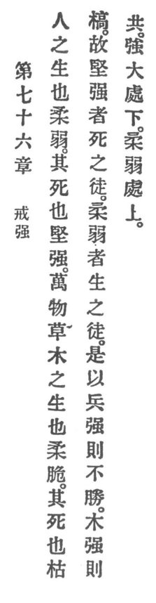

  
[Intangible Textual Heritage](../../index)  [Taoism](../index.md) 
[Index](index)  [Previous](crv081)  [Next](crv083.md) 

------------------------------------------------------------------------

### 76. BEWARE OF STRENGTH.

|                    |
|--------------------|
|  |

1\. Man during life is tender and delicate. When he dies he is stiff and
stark.

p. 127

2\. The ten thousand things, the grass as well as the trees, while they
live are tender and supple. When they die they are rigid and dry.

3\. Thus the hard and the strong are the companions of death. The tender
and the delicate are the companions of life.

Therefore he who in arms is strong will not conquer.

4\. When a tree has grown strong it is doomed.

5\. The strong and the great stay below. The tender and the delicate
stay above.

------------------------------------------------------------------------

[Next: 77. Heaven's Reason](crv083.md)
