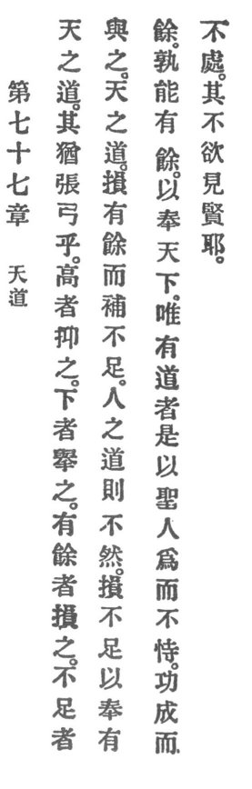

  
[Intangible Textual Heritage](../../index)  [Taoism](../index.md) 
[Index](index)  [Previous](crv082)  [Next](crv084.md) 

------------------------------------------------------------------------

### 77. HEAVEN'S REASON.

|                    |
|--------------------|
|  |

1\. Is not Heaven's Reason truly like stretching a bow? The high it
brings down, the lowly it lifts up. Those who have abundance it
depleteth; those who are deficient it augmenteth.

2\. Such is Heaven's Reason. It depleteth those who have abundance but
completeth the deficient.

3\. Man's Reason is not so. He depleteth the deficient in order to serve
those who have abundance.

p. 128

4\. Where is he who would have abundance for serving the world?

5\. Indeed, it is the holy man who acts but claims not; merit he
acquires but he does not dwell upon it, and does he ever show any
anxiety to display his excellence?

------------------------------------------------------------------------

[Next: 78. Trust in Faith](crv084.md)
