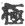
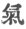

  
[Intangible Textual Heritage](../../index)  [Taoism](../index.md) 
[Index](index)  [Previous](crv115)  [Next](crv117.md) 

------------------------------------------------------------------------

### CHAPTER 42.

The subject of oneness or unity treated in Chapter 39 is here continued,
and

p. 167

unity is represented as the product of the Tao, or Reason.

The trinity idea plays an important part in human thought almost
everywhere, in philosophical systems and in many religions including
Christianity. The Chinese idea of trinity is based on the notion that
there are two opposed principles, Yang and Yin, which have originated,
as Lao-tze explains, from a primordial oneness, called by Cheu-tze and
other later philosophers *Chi*, the ultimate, or the absolute. Oneness
produces by differentiation a twohood, viz., the twohood of Yang, or
heaven, and Yin, or earth. Between heaven and earth is the air, *Ch‘i*,
the breath of life; and from this trinity of Yang, Yin and Ch‘i all
things are derived.

Incidentally we must warn the reader that *chi*, the ultimate, [1](#fn_29.md) is quite different from *ch‘i*,
breath. [2](#fn_30.md)

p. 168

The words *ku kwa*, here translated "orphaned, lonely," mean, the former
"a fatherless son," and the latter "lonely"; and in this sense the
emperor has been called the "lonely one" as one who stands aloof, who is
solitary, peerless and without equal. But the original meaning is still
prominent in the term and so we may look upon Lao-tze's use of the word
as a pun which he uses as a peg upon which to hang a lesson. The word
*kwa*, "lonely," has the meaning of "little" and "insignificant" which
in agreement with a Chinese view of politeness is also used in the sense
of "your humble servant," or as the Germans say, *meine Wenigkeit*,
which may justly be considered an adequate equivalent for the Chinese
*kwa*.

The term pu ku is used in the same sense as *kwa*, meaning literally
"not worthy," as a modest expression in which the speaker refers to
himself. It serves so commonly as an equivalent for the

p. 169

pronoun of the first person that even the emperor does not scorn it.
However the former words *ku kwa* denote the emperor as a peerless
person, the only one of his kind, the man who has no equal.

\*   \*   \*

Lao-tze is certainly an original thinker and yet he disclaims
originality; he constantly quotes his predecessors, but he reads his own
thoughts into their sayings. He says here, "What others have taught I
teach also," but in Chapter 15 he says that they are too profound to be
understood, and so he endeavors to make them intelligible.

\*   \*   \*

The chapter concludes with a statement which tradition explains as
meaning that he will "expound the doctrine's foundation," but the
literal reading of the last six words runs thus:

"I shall do the doctrine's father."

The word *fu*, "father," pictures a hand with a rod and means "rule,
authority, father, fatherly or loving." It is the most common word for
"father" and

p. 170

ought to be so translated unless weighty reasons speak against it.

The word *wei*, commonly translated "to do," may mean "to live up to, to
actualize, to exemplify, to do the will of, to obey." Obviously it means
the actual doing, not the purely theoretical expounding, and so we
explain the passage to mean, "While the mass of mankind are violent and
self-willed, which leads to trouble and an unnatural death, I mean to
exemplify in my life the will of the doctrine's father," or in a more
literal rendering "But I will obey the doctrine's father (i. e., the
Tao)."

------------------------------------------------------------------------

### Footnotes

[167:1](crv116.htm#fr_29.md)   Chi is used by Lao-tze in its
ordinary sense in Chapter 16, and 68, last word. For the philosophical
terms *t‘ai chi* and *wu chi* see [p. 138](crv092.htm#page_138.md) and
compare Giles's Dictionary, No. 859.

[167:2](crv116.htm#fr_30.md)   *Ch‘i*, breath, occurs three
times in our p. 168 text: (1) translated
"airs" in Sze ma Tsien's biography of Lao-tze; (2) translated "vitality"
in Chapter 10; and (3) "breath," in Chapter 42. See Giles's Dictionary
No. 1064. The word is also transcribed *k‘i*.

------------------------------------------------------------------------

[Next: Chapter 45](crv117.md)
