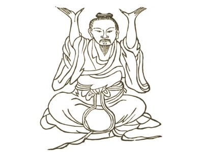

  
[Intangible Textual Heritage](../../index)  [Taoism](../index.md) 

------------------------------------------------------------------------

<table width="75%">
<colgroup>
<col style="width: 50%" />
<col style="width: 50%" />
</colgroup>
<tbody>
<tr class="odd">
<td width="50%" data-valign="TOP"></td>
<td width="50%" data-valign="CENTER"><h1 id="kung-fu-or-tauist-medical-gymnastics" data-align="CENTER">Kung-Fu, or Tauist Medical Gymnastics</h1>
<h2 id="by-john-dudgeon" data-align="CENTER">by John Dudgeon</h2>
<h4 id="section" data-align="CENTER">[1895]</h4></td>
</tr>
</tbody>
</table>

------------------------------------------------------------------------

[Contents](#contents)    [Start Reading](kfu000.md)    [Page
Index](pageidx)    [Text \[Zipped\]](kfu.txt.gz.md)

------------------------------------------------------------------------

This is an extremely rare 19th century treatise on Chinese medicine,
particularly the practices of the Kung Fu school. This has never been
reprinted, and was scanned from a rare copy in the possession of the
University of California. Although best known for a fighting style, Kung
Fu includes a whole range of medical practices based on late Taoist
alchemy. Dudgeon describes the use of yoga-like postures, movements
similar to Tai Chi, the use of healing sounds similar to mantras, as
well as massage and other techniques. He gives specifics of compounds
used to treat a wide range of ailments in conjunction with the other
methods. Dudgeon describes Taoist deities and sages, and gives extensive
background on Chinese medical theory. This text is an invaluable look at
the esoteric medical practices of the Chinese prior to the 20th century.

*Important:* This is an historical text which includes accounts of 19th
century Chinese medical practices, presented for the purpose of
education and entertainment. Please do not attempt any of the exercises
or treatments described in this document without consulting your
physician first.

*Production Notes:* I had to scan this from a PDF
created by Google books, by printing out the PDF and then bulk-scanning
the pages back in. Because of the poor quality of the printing in the
original text, it is likely that there are additional errata which have
not been corrected. Several sections which were printed entirely in
small type have been presented in the default type size for purposes of
readability. Locations of untranscribed Chinese characters in the text
are indicated by a single hash sign (\#). Due to the number of diagrams
in the text, I have broken it down into files based on the number of
images per file, so as to not have to thumbnail the images. --J.B. Hare,
October 9, 2008.

------------------------------------------------------------------------

 [Title Page](kfu000.md)  
[Introduction](kfu001.md)  
[The Eight Ornamental Sections](kfu002.md)  
[The Five Animals](kfu003.md)  

### Kung-fu for the Four Seasons

[Introduction](kfu004.md)  
[1. For the Solar Term of the First Month, or 'Beginning of
Spring.'](kfu005.md)  
[2.—For the Middle of the First Month, or 'Rain Water.'](kfu006.md)  
[3.—Second Month, name of Solar Term,—the 'Waking of Insects'](kfu007.md)  
[4.—Middle of the Second Month,—termed the 'Spring Equinox.'](kfu008.md)  
[5.—Third Month,—Solar Term 'Pure Brightness.'](kfu009.md)  
[6.—Middle of the Third Month,—termed 'Corn Rain.'](kfu010.md)  
[7.—Fourth Month, Solar Term named 'Beginning of Summer.'](kfu011.md)  
[8.—The Middle of the Fourth Month, termed 'Small Full.'](kfu012.md)  
[9.—For the Solar Term of the Fifth Month, named 'Sprouting
Seeds.'](kfu013.md)  
[10.—The Middle of the Fifth Month, termed 'Summer Solstice.'](kfu014.md)  
[11.—For the Solar Term of the Sixth Month, named 'Slight
Heat.'](kfu015.md)  
[12.—For the Middle of the Sixth Month, termed 'Great Heat.'](kfu016.md)  
[13.—For the Solar Term of the Seventh Month, called 'Beginning of
Autumn.'](kfu017.md)  
[14.—For the Middle of the Seventh Month, termed 'Stopping of
Heat.'](kfu018.md)  
[15.—For the Solar Term of the Eighth Month, termed 'White
Dew.'](kfu019.md)  
[16.—Middle of the Eighth Month, named 'Autumnal Equinox.'](kfu020.md)  
[17.—For the Solar Term of the Ninth Month, called 'Cold
Dew.'](kfu021.md)  
[18.—Middle of the Ninth Month, termed 'Frosts Descent.'](kfu022.md)  
[19.—The Solar Term of the Tenth Month, called 'Beginning of
Winter.'](kfu023.md)  
[20.—For the Middle of the Tenth Month, termed 'Slight Snow.'](kfu024.md)  
[21.—For the Solar Term of the Eleventh Month, named 'Great
Snow.'](kfu025.md)  
[22.—For the Middle of the Eleventh Month, called 'Winter
Solstice.'](kfu026.md)  
[23.—For the Solar Term of the Twelfth Month, named 'Slight
Cold.'](kfu027.md)  
[24. For the Middle of the Twelfth Month, termed 'Great
Cold.'](kfu028.md)  

### Medicinal Kung

[No. 1—The Honourable and Real Form of the Great Pure Ancestral
Teacher](kfu029.md)  
[No. 2.—The Venerable Prince Li playing the Lute](kfu030.md)  
[No. 3.—Hsü Shên-wêng's Method of preserving the Air and opening the
Passes](kfu031.md)  
[No. 4.—The Immortal with the Iron Crutch pointing the Way](kfu032.md)  
[No. 5.—The Maiden Immortal Ho slowly ascending to Heaven](kfu033.md)  
[No. 6.—Pai Yü-ch‘an seizing his Food like the Tiger](kfu034.md)  
[No. 7.—Han Chung-li's Method of sounding the Heavenly Drum](kfu035.md)  
[No. 8.—The Immortal Maiden Ts’ao looking at the Figure of the Ultimate
Principle of Being](kfu036.md)  
[No. 9.—Ch‘ieu Ch’ang-ch‘un’s Method of Turning the Windlass](kfu037.md)  
[No. 10.—Ma Tan-yang's Method of using the strength of Fire for the
whole Body](kfu038.md)  
[No. 11.—Chang Tze-yung driving the Pestle](kfu039.md)  
[No. 12.—Miss Huang-hua Sleeping on Ice](kfu040.md)  
[No. 13.—Yin Ching-ho's Sleeping Plan](kfu041.md)  
[No. 14.—Li Ch‘i-ch‘an’s Method of dispersing the Semen](kfu042.md)  
[No. 15.—The Maiden Chang Chên-nü fixing her Animal Spirits](kfu043.md)  
[No. 16.—Wei Po-yang's Method of beating the Wind](kfu044.md)  
[No. 17.—Hsueh Tao-kwang rubbing his Heel](kfu045.md)  
[No. 18.—Ko Hsien-wêng opening the Thorax](kfu046.md)  
[No. 19.—Wang Yü-yang's Method of dispersing Pain](kfu047.md)  
[No. 20.—The Maiden Ma rubbing (away) the Disease](kfu048.md)  
[No. 21.—The Picture of Chang Kwo-lao abstracting from and adding to the
strength of Fire](kfu049.md)  
[No. 22.—Ch’ên’s kung for obtaining his Great Sleep](kfu050.md)  
[No. 23.—Shih Hsing-lin's Method of warming the Tan-tien](kfu051.md)  
[No. 24.—Han Hsiang-tse’s Figure for nourishing Man's Heart](kfu052.md)  
[No. 25.—Miss Chao-ling's manner of making disease go](kfu053.md)  
[No. 26.—Lü Ch’un-yang’s Figure of sustaining the Pulse](kfu054.md)  
[No. 27.—Ch’ên Hsi-i imitating the Cow descending from looking at the
Moon](kfu055.md)  
[No. 28.—Fu-yeu-ti-chün drawing the Sword from its Scabbard](kfu056.md)  
[No. 29.—The divine ancestor Hsü shaking the Heavenly Pillar](kfu057.md)  
[No. 30.—Ch’ên Ni-wan’s Method of grasping the Wind's Nest](kfu058.md)  
[No. 31.—Ts’ao Kwo-chieu taking off his Boots](kfu059.md)  
[No. 32.—Chao Shang-tsao’s Method of transferring and stopping the
ching](kfu060.md)  
[No. 33.—The pure peaceful Heavenly Preceptor's Sleeping Kung](kfu061.md)  
[No. 34.—Sun Hsuen-hsü imitating the Black Dragon taking hold of his
Claws](kfu062.md)  
[No. 35.—Kau Hsiang-sien’s imitation of the Phoenix  spreading its
Wings](kfu063.md)  
[No. 36.—Fu Yuen-hsü embracing the Vertex](kfu064.md)  
[No. 37.—The immortal Li Hung-chi admiring the Moon](kfu065.md)  
[No. 38.—Li T‘ieh-kwai the Immortal leaning on his Staff](kfu066.md)  
[No. 39.—The True Jade Immortal's method of harmonizing the Hall of the
Kidneys](kfu067.md)  
[No. 40.—Li Ye-p‘o imitating the child reverencing](kfu068.md)  
[No. 41.—Lan Ts‘ai-ho imitating the Black Dragon shaking his
Horns](kfu069.md)  
[No. 42.—Hsia Yün-fêng imitating the Black Dragon in a horizontal
position on the Ground](kfu070.md)  
[No. 43.—Ho T‘ai-ku supporting Heaven, seated](kfu071.md)  
[No. 44.—Liu Hsi-ku exhibiting terribly the Ferocious Tiger](kfu072.md)  
[No. 45.—Miss Sun Pu-erh waving the Flag](kfu073.md)  
[No. 46.—Chang Yao-yang imitating the Child worshipping the Goddess of
Mercy](kfu074.md)  
[No. 47.—Tung Fang-shuo's Method of grasping his Big Toes](kfu075.md)  
[No. 48.—The Patriarch of P‘êng’s Method of brightening the
Vision](kfu076.md)  
[Extra Curative Kung without Prescriptions](kfu077.md)  
[The Dragon Series](kfu078.md)  
[The Tiger Series](kfu079.md)  

 

[Kneading](kfu080.md)  
[Books on Kung-fu](kfu081.md)  
[Kneading](kfu082.md)  
[Method for Acquiring the Essences of the Sun And Moon](kfu083.md)  
[The Eighteen Disciplinary Records](kfu084.md)  
[Divisions under the External Method](kfu085.md)  
[Notes on Kung-Fu Regulating the Various Parts of the Body](kfu086.md)  

### The Twelve Positions

[1.—The First Aspect of Wei-to](kfu087.md)  
[2.—The Second Aspect of Wei-to](kfu088.md)  
[3.—The Third Aspect of Wei-to](kfu089.md)  
[4.—Taking away a star and changing the Dipper for it](kfu090.md)  
[5.—Pulling Nine Oxen's tails backwards](kfu091.md)  
[6.—Pushing out the Claws and Extending the Wings](kfu092.md)  
[7.—Nine Devils drawing a dagger](kfu093.md)  
[8.—Three Plates falling on the ground](kfu094.md)  
[9.—The Azure Dragon stretching its Claws](kfu095.md)  
[10.—The Lying Tiger springing at his Food](kfu096.md)  
[11.—Making a Bow](kfu097.md)  
[12.—Wagging the Tail](kfu098.md)  
[The Nine Figures to Remove Disease and Lengthen Life](kfu099.md)  
[Description of Diagrams](kfu100.md)  
[Physiology of Kung-fu](kfu101.md)  
[Diagrams Illustrating the Physiology of Kung-fu](kfu102.md)  
[Conclusion](kfu103.md)  
