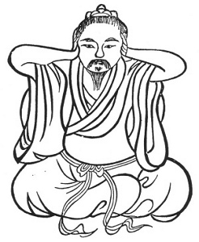
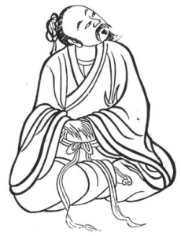
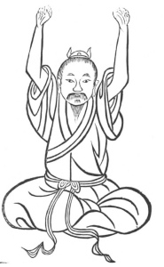
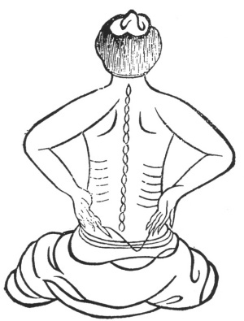
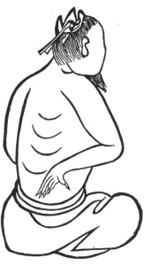
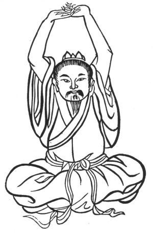
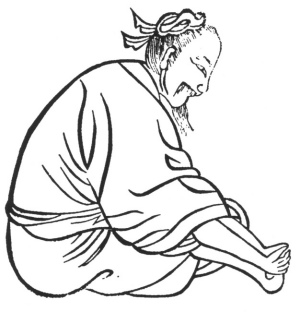

  
[Intangible Textual Heritage](../../index)  [Taoism](../index.md) 
[Index](index)  [Previous](kfu001)  [Next](kfu003.md) 

------------------------------------------------------------------------

  
*Kung-Fu, or Tauist Medical Gymnastics*, by John Dudgeon, \[1895\], at
Intangible Textual Heritage

------------------------------------------------------------------------

### The Eight Ornamental Sections.

This name has been handed down by the sages of antiquity, and hence the
eight illustrations. The object aimed at is to prevent the entrance of
demons and vicious air, to obtain clearness in dreams and sleep, and not
stupidity, to shut out cold and heat from the body, and prevent disease
from gaining a lodgment. The time when

p. 102

the exercises are enjoined to be carried out is after the third watch
(11 to 1 a.m.), and before noon, as this period agrees with the creation
of heaven and earth, and also with their fixed series of diurnal
revolutions; and the blood and air cannot stop, but must proceed also in
their revolutions, and this is in accordance with the principles of the
Eight Diagrams, which has excellent reason on its side. The idea in the
expression "to close the fist tightly" has not been deeply investigated.
Not only must the eyes be closed and see one's own eyes, and thus the
heart shut to the external world, but at the time of sitting
cross-legged, the left heel must be so flexed as to buttress the movable
place (perinæum) below the root of the *membrum virile* of the kidney,
so as to prevent leakage of the semen. In performing this *kung*, it is
not absolutely necessary to do it at the periods specified. Any time of
the day when the body is at leisure and the heart unoccupied will do
equally well. To use the exercise much or little must be left to each
one's own discretion. If persons, however, will abide by the after
midnight and before noon arrangements, then, if at these periods they
should have no leisure, what then? Those who wish to learn *Tao* cannot
but understand this. Such is the native introduction to these sections.
It will be observed that they are prophylactic.

No. 1.—*Knocking the teeth and collecting the spirits*. Bump the teeth
and assemble the spirits 36 times. Let the two hands embrace the
*Kw’en-lun* [\*](#fn_0) (the head.md) and

p. 103

beat the "Heavenly Drum" (the occiput) 24 times. *Note*.—The eyes must
first be shut, and the heart dark (*i.e.*, in Tauist phraseology, sit
cross-legged), the fists must be tightly closed, and the heart at rest,
and both hands placed behind the vertex (of the head); then 9
respirations such that the ears will not hear, afterwards respire, but
still to be inaudible to the ears; then sound the "Heavenly Drum'' 24
times; afterwards knock the teeth and assemble the spirits; then both
hands with their palms must cover the ears, and the fore-finger is to
press upon the middle finger, and the back of the brain to be tapped
right and left each 24 times. (The occiput is also sometimes termed the
"Jade Pillow").

 

p. 104

No. 2.—*Shaking the "Heavenly Pillar"*. The right and left hand to shake
the "heavenly pillar" each 24 times. *Note*.—First close the fists
tightly, then move the head once right and left, look at the shoulder
and upper arm while following the movement 24 times.

 

p. 105

No. 3.—*The Tongue Exciting Gargling and Swallowing the Saliva*. Let the
tongue stir up the palate right and left 36 times, gargle 36 times,
divide into 3 mouthfuls, and, like hard things, swallow \[the saliva
thus produced\], and afterwards the "fire" (inflammation) will go.

 

p. 106

*Note*.—Let the tongue excite the mouth, teeth, right and left cheeks;
and, when the saliva has been thus produced, then gargle; and, when the
mouth is full, then swallow it. The tongue is the "red dragon," the
saliva is the "divine water," and the swallowing of the three mouthfuls
must imitate the sound *ku ku* (\#, the sound of gurgling water).

No. 4.—*Rubbing the Kidneys*. With both hands rub the court or hall of
the kidneys (the loins) 36 times, the more the better. (T’ang \[\#\],
chia \[\#\], and fu \[\#\], are indifferently used; and, when applied to
the viscera, denote their residence). *Note*.—Close the respiration, rub
the hands until warm, then rub the kidneys according to the number of
times already mentioned; afterwards draw back the hands, close the fists
tightly. Again shut the breath, reflect, use the fire of the heart and
burn (heat) the *tan tien* (navel); and, when you feel that it has
become very hot, then use the subsequent method. In the expression "the
dragon going and the tiger fleeing," the saliva represents the dragon
and the air \[of respiration\] the tiger. In closing the breath and
rubbing the hands warm, the nose first inspires the pure air, and then
the respiration is closed; after a little, the hands are rubbed quickly
until they become quite hot; then slowly let the nose give exit to the
air. To rub the back *ching mên*, \# (*i.e.*, semen door) means the
external kidney behind the loins (as explained. by the Chinese). When
the joining of the hands in rubbing is finished, withdraw the hands and
grasp the fists firmly (as before). Again shutting off the air, think of

p. 107

the fire as burning the "wheel of the navel." This refers to the tan
tien, and using the "heart fire" to think it down to the heating of the
*tan lien*.

 

p. 108

No. 5.—*Winding the Single Pulley*. With the right and left \[hand\],
turn the single pulley 36 times. *Note*.—First bend the head and move
the left shoulder 36 times, then the right also 36 times.

 

p. 109

No. 6.—*Winding the Double Pulley*. Thirty-six times. *Note*.—Move the
two shoulders like a pendulum 36 times. Bend the head, move the
shoulders, think the fire from the tan tien upwards by the "double pass"
(one of the acupuncture apertures in the back) to the brain, the nose
introducing the pure air; then close for a brief period, and extend the
feet.

 

p. 110

No. 7.—*Pressing the Vertex*. Rub the two hands together, and after five
hems (voluntary half-coughs, in Chinese, *k’o*, \#), interlace the hands
and support Heaven, and then press the vertex each 9 times.
*Note*.—Interlock the hands and raise them aloft to support the void 3
or 9 times.

 

p. 111

No. 8.—*Grasping the Hook*. Let the two hands take the form of a hook,
advance them to the front, grasp the soles of the two feet 12 times,
again withdraw the feet and sit upright. Note.—Bring both hands to the
front, clasp the soles of the feet 12 times, re-collect the feet and sit
upright. Wait till the saliva in the mouth is produced, then gargle and
swallow according to the number of times already indicated, move the
shoulders and body 24 times, and also the pulley exercise (termed the
"river cart") 24 times; think the fire of the *tan-tien* from below
upwards, and burn (heat) the body. At the time of thinking, the mouth
and nose must be closed for a very little. Wait till the saliva is
produced in the mouth; if it fail, then re-excite it, gargle and swallow
according to the former method. When the "divine water" is swallowed 9
times, and the gurgling sound produced, the pulses become all harmonized
and regulated.

 

------------------------------------------------------------------------

### Footnotes

[102:\*](kfu002.htm#fr_0.md) A mountain of Central
Asia, the Hindu Kush, widely celebrated in Chinese legends, especially
in ancient fable and Tauist mythology. The cosmogonists and mystics
elevated it to the position of the central mountain of the earth, or as
we say now "the roof of heaven," and the source of the "four great
rivers," also the residence of the queen of the genii. Innumerable
marvels are related of this mountain, with its trees of pearls,
jade-stone, and immortality. The appropriation of the name of this
mountain to the head is, therefore, not out of place.

------------------------------------------------------------------------

[Next: The Five Animals](kfu003.md)
