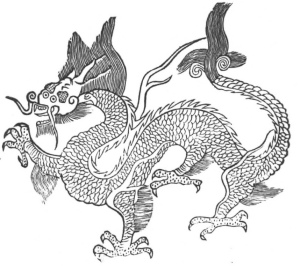

  
[Intangible Textual Heritage](../../index)  [Taoism](../index) 
[Index](index)  [Previous](kfu003)  [Next](kfu005) 

------------------------------------------------------------------------

  
*Kung-Fu, or Tauist Medical Gymnastics*, by John Dudgeon, \[1895\], at
Intangible Textual Heritage

------------------------------------------------------------------------

p. 119

### Kung-fu for the Four Seasons.

In the year's exercises, we must omit all references to the time each
day, which ranges from mid-night to 7 a.m., when they are enjoined; also
the numerous correlations with pulses, blood-vessels, viscera, the five
elements and their natures, the atmospheric influences,—whether
heavenly, earthly, or respiratory,—the eight diagrams, the cyclical
signs, points of the compass, etc. There are two exercises for each
month, making 24 in all, arranged according to the 24 solar terms or
periods (breaths) of the year, corresponding to the day on which the sun
enters the first and fifteenth degree of one of the zodiacal signs. To
each of these an appropriate name is given, which we have retained, as
they are in popular use. The exercises are arranged according to the
four seasons, and each season is prefixed and suffixed with some animal
representing the correlated viscera. These we have also retained from
their quaintness, excellency of design, and with the view of conveying
an idea of the Chinese correspondencies. It will be observed that the
Black Tiger and the Dragon occur very frequently in the Tauist works.
Charms also frequently accompany them; but, as this is a wide subject
and has a special form of treatment, it is omitted here. It has been
discussed elsewhere. The various correlations of the human body will be
found treated in the *Philosophy of Chinese Medicine*, a work
contemplated by the writer. In the medicinal exercises which follow, I
have given the prescriptions attached to them, as they throw some light
upon their materia medica and mode of preparing drugs, the nature of
their recipes, etc. Included in the chapters on *Seasonable Regimen*,
referred to further on, are found prescriptions ascribed to

p. 120

the Yellow Emperor (2697 B.C.), to cure or prevent diseases of the
viscera which are omitted. The spring governs birth; summer, growth;
autumn, harvesting; and winter, storage. For each period and for each
viscus, the various things that regulate and assist are given; what is
indicated and what contra-indicated, with all matters that ought to be
attended to.

The liver is the viscus which stands at the head of the three months of
spring. It is represented as a dragon (see illustration, below). The
name of its spirit is "Dragon Smoke;" its appellation is "Containing
Brightness."

 

p. 121

\[paragraph continues\] The form of the
liver is that of a dragon; it stores up the soul; it resembles a banging
bottle-gourd of a whitish brown colour; it is placed below the heart, a
little nearer the back; the right has four lobes, the left three lobes;
its pulse emerges from the end of the thumb. The liver is the mother of
the heart and the son of the kidneys. To repair and nourish it, during
the first half of the three months, one must sit facing the east, knock
the teeth 3 times, shut the breath and inspire 9 times; breathe the
south air,—take in 9 mouthfuls and swallow 9 times. Certain medicines
are also ordered. The *kung* to direct the liver for the spring three
months is to press equally the two hands on the shoulders, slowly press
the body right and left each three times. It can also be done by
clasping or interlocking the two hands, turning the palms and dorsa
alternately to the chest 3 × 5 times. This will cure obstruction of the
liver from vicious wind and poisonous air, and prevent disease from
developing. These exercises must be incessantly attended to morning and
evening in the spring, without intermitting even one day; and, with the
heart set upon it, the cure is complete. If, after driving out the
corrupt air, the eyes be fixed and closed, opening them only a little,
and then puff out the air slowly and by little, the cure of a flushed
face and flow of tears will be effected.

------------------------------------------------------------------------

[Next: 1. For the Solar Term of the First Month, or 'Beginning of
Spring.'](kfu005)
