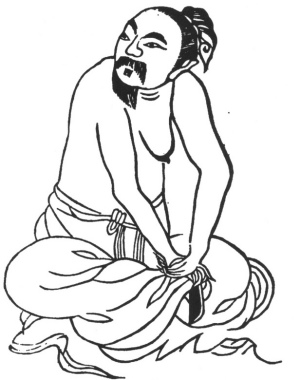

  
[Intangible Textual Heritage](../../index)  [Taoism](../index.md) 
[Index](index)  [Previous](kfu005)  [Next](kfu007.md) 

------------------------------------------------------------------------

  
*Kung-Fu, or Tauist Medical Gymnastics*, by John Dudgeon, \[1895\], at
Intangible Textual Heritage

------------------------------------------------------------------------

p. 122

 

2.—*For the Middle of the First Month, or "Rain Water."*—Hands folded,
press the thigh, turn the neck and body as before, alternately to the
right and left 3 × 5 times, etc., as above. For the cure of obstruction
and the storing up of vicious poison in the Three Divisions (imaginary
viscera) and net-work of vessels, difficult deglutition, deafness, and
pain of the eyes. [\*](#fn_2.md)

------------------------------------------------------------------------

### Footnotes

[122:\*](kfu006.htm#fr_2.md) The illustration, being
identical with the above Figure, is omitted; the pressure of the hand is
applied to the right instead of the left thigh, and the head is turned
to the left. The character used in the second is *pi* (\#), which is not
found in any of our Chinese-English Dictionaries. In the writer's
*Vocabulary of Anatomical Terms*, to be published shortly, it refers to
the region of the stomach. The part to be pressed upon in the above
Figure is *pi* (\#), the thigh, which agrees with the illustrations.

------------------------------------------------------------------------

[Next: 3.—Second Month, name of Solar Term,—the 'Waking of
Insects'](kfu007.md)
