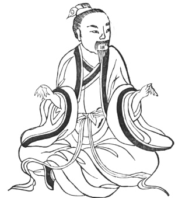

  
[Intangible Textual Heritage](../../index)  [Taoism](../index) 
[Index](index)  [Previous](kfu006)  [Next](kfu008) 

------------------------------------------------------------------------

  
*Kung-Fu, or Tauist Medical Gymnastics*, by John Dudgeon, \[1895\], at
Intangible Textual Heritage

------------------------------------------------------------------------

p. 123

3.—*Second Month, name of Solar Term,—the "Waking of Insects"* (animals
that have secreted themselves all winter are supposed to come out on
this day).—Close the fists tightly, turn the neck, move the elbows like
the wings \[of a bird\] 5 × 6 times, draw them backwards and forwards,
tap the teeth 6 × 6 times, inspire and swallow 3 × 3 times. To cure the
corrupt poison and obstructions of the loins (lumbago), back, lungs, and
stomach, dryness of the mouth, yellowness of the eyes, epistaxis,
difficult deglutition, face swollen, aphasia, rheumatism of the head,
tooth-ache, darkness of vision, intolerance of light, loss of smell,
polypus, and boils all over the body.—See Figure, below.

 

------------------------------------------------------------------------

[Next: 4.—Middle of the Second Month,—termed the 'Spring
Equinox.'](kfu008)
