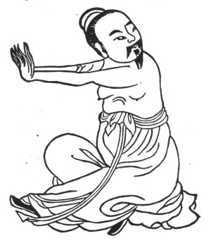

  
[Intangible Textual Heritage](../../index)  [Taoism](../index) 
[Index](index)  [Previous](kfu007)  [Next](kfu009) 

------------------------------------------------------------------------

  
*Kung-Fu, or Tauist Medical Gymnastics*, by John Dudgeon, \[1895\], at
Intangible Textual Heritage

------------------------------------------------------------------------

p. 124

4.—*Middle of the Second Month,—termed the "Spring Equinox."*—Extend the
hands, turn the head to the right and left 6 × 7 times, knock the teeth
6 × 6, inspire and swallow 3 × 3. To cure weakness and the vicious
poison of the chest (consumption), shoulders, back, and small
blood-vessels, tooth-ache, neck swollen, rigors, feverishness, deafness
or ear-ache, tinnitus aurium, pain. behind the ears, pain of the
shoulders, elbow, upper arm, and back, oppression in the lungs
(fulness), skis feeling like a husk or shell (not painful but
itchy).—*See* Figure, below.

 

------------------------------------------------------------------------

[Next: 5.—Third Month,—Solar Term 'Pure Brightness.'](kfu009)
