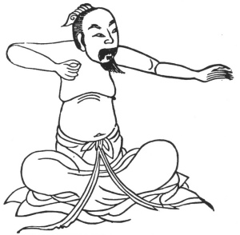

  
[Intangible Textual Heritage](../../index)  [Taoism](../index.md) 
[Index](index)  [Previous](kfu008)  [Next](kfu010.md) 

------------------------------------------------------------------------

  
*Kung-Fu, or Tauist Medical Gymnastics*, by John Dudgeon, \[1895\], at
Intangible Textual Heritage

------------------------------------------------------------------------

p. 125

5.—*Third Month,—Solar Term "Pure Brightness."*—Change hands right and
left, like drawing the bow, each 7 × 8 times, knock the teeth, respire,
taking in the outside pure air to displace the foul air from within, and
swallow the saliva each 3 times. To cure the weakness and vicious air of
the loins, kidneys, intestines, and stomach, painful deglutition, ears
deaf .and painful, pain of the neck and inability to turn it, pain in
the shoulder and unable to raise it, body bent and without strength, arm
painful, and weakness of the loins.—See Figure, below. [\*](#fn_3.md)

 

------------------------------------------------------------------------

### Footnotes

[125:\*](kfu009.htm#fr_3.md) This Figure corresponds
with Amiot's No. 2, which is explained as directed against asthma and
the pains of the loins and bowels. It is not necessary to turn the head.

------------------------------------------------------------------------

[Next: 6.—Middle of the Third Month,—termed 'Corn Rain.'](kfu010.md)
