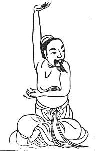
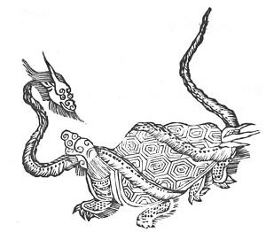
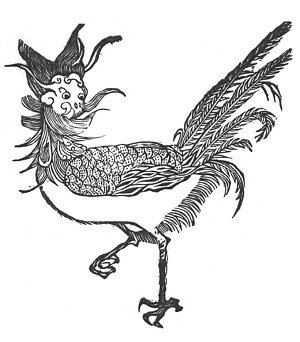

  
[Intangible Textual Heritage](../../index)  [Taoism](../index.md) 
[Index](index)  [Previous](kfu009)  [Next](kfu011.md) 

------------------------------------------------------------------------

  
*Kung-Fu, or Tauist Medical Gymnastics*, by John Dudgeon, \[1895\], at
Intangible Textual Heritage

------------------------------------------------------------------------

p. 126

6.—*Middle of the Third Month,—termed "Corn Rain."*—Sitting evenly,
alternately raise the right and left hand as if supporting something,
and alternately with the

 

p. 127

right and left cover the breasts, each 5 × 7 times, etc. [\*](#fn_4.md) To cure blood obstruction in the spleen and
stomach, yellowness of the eyes, bleeding of the nose; cheeks, neck and
arm swollen and painful, palms of the hands hot.—See Figure, opposite
page. [†](#fn_5.md)

 

p. 128

The name of the spirit of the gall-bladder is "Glorious Dragon," and its
appellation "Majestic Brightness." Its form is that of a tortoise coiled
round by a serpent (see illustration on previous page); its resemblance
is to a suspended gourd; its colour is a green purple; it is placed in
the middle of the liver. Its *kung* is to sit upright, place the two
soles of the feet together, raise the head, with the two hands take hold
of the ankles and move the feet 3 × 5 times. Or with the two hands press
the ground, straighten the body, and add force to the loins and back 3 ×
5 times. In this way, the vicious air and poisonous wind can be driven
out.

Then follow the summer three months,—Fourth, Fifth, and Sixth. The
period starts with the picture of the heart. The name of its spirit is
"Great Red;" its designation is "Guarding the Soul;" its form is like
"the Scarlet Bird" (the fancy name of a position in geomancy); as the
Red Ruler, it stores up the spirit. It resembles the lotus turned upside
down; in colour, like white reflected on brown; it is placed in the
middle of the lungs above the liver, one inch below the apex of the
ensiform cartilage (in Chinese the aperture called the "dove's tail").
The pulse of the heart issues from the end of the left middle finger, at
the aperture termed "the communicating centre." In order to direct the
heart into a right course, sitting straight, with both hands clenched,
with strength ram down alternately the right and left each 5 × 6 times.
Also, with one hand raised aloft in space as if supporting a picul of
rice, right and left alternately. Also, with both hands clasped, and the
foot placed within the clasped hands, each 5 × 6 times, during which
period let the breath be held, to drive out all diseases caused by
vicious wind in the heart and thorax. This exercise to be performed for
a long time, with the eyes shut, the saliva swallowed

p. 129

\[paragraph continues\] 3 times, and the
teeth knocked 3 times. Afterwards hem slowly. Whatever grief may be in
the heart or ulcers in the mouth will be cured. Or, sitting upright,
throw both fists forward (as if fighting), and bring them back 6
times.—See illustration, below.

 

p. 130

Additional two exercises for directing the heart are given as
follows:—*First*, sitting upright, body inclined, use strength in this
position like a hill. supporting a hill. In this way, sit, using force
to drive out the vicious wind of the loins and spine, to make pervious
the five viscera and six *fu*, to disperse foot vapours (gout), to tone
the heart, and strengthen the system; and do it the same on the right
and left sides. The *second* method is with one hand to press the
stomach, one hand raised upwards; use all your strength as if supporting
a stone, and retain the breath; and do the same on both sides, to dispel
the poisonous wind of the ribs, to cure the heart, and cause the blood
and pulses to circulate and harmonize.

When the seven apertures of the heart are all open, the Chinese assert
the highest intelligence. With a moderate amount of wisdom, only five
openings are pervious; and, in the case of the intensely stupid, all the
openings are blocked up, and no air passes through. The heart is the son
of the liver and mother of the spleen (in their view).

In the beginning of the Fourth and Fifth months, early in the morning,
facing the south, sitting straight, bump the teeth 9 times, gargle the
saliva in the mouth 3 times, silently think, draw the south air into the
mouth and swallow 3 times, hold the breath, and take 30 inspirations
after each such holding, and so fill up and replace the vicious air.

------------------------------------------------------------------------

### Footnotes

[127:\*](kfu010.htm#fr_4.md) Each exercise concludes
invariably with the phrase *t‘u2 na yen ye* (\#) which we
have translated *respire and swallow the saliva* so many times. The word
*t‘u* refers to the air coming out of the mouth softly and slowly
(expiration); *na* to its entering by the nose (inspiration) also slowly
and continuously. The expression is equivalent to breathing out the foul
and sniffing in the pure air. The repetition of the phrase is omitted.

The air of expiration moves the "heavenly stems" (10), and the air of
inspiration the "earthly branches" (12); those cyclical signs forming
the cycle of 60 combinations.

[127:†](kfu010.htm#fr_5.md) This Figure corresponds
with No. 4 of Amiot, which is said to be against embarrassment and
obstruction of the stomach and jaundice.

------------------------------------------------------------------------

[Next: 7.—Fourth Month, Solar Term named 'Beginning of Summer.'](kfu011.md)
