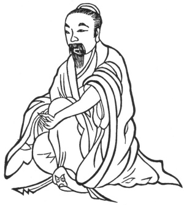
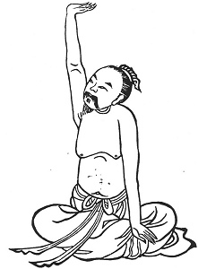

  
[Intangible Textual Heritage](../../index)  [Taoism](../index) 
[Index](index)  [Previous](kfu011)  [Next](kfu013) 

------------------------------------------------------------------------

  
*Kung-Fu, or Tauist Medical Gymnastics*, by John Dudgeon, \[1895\], at
Intangible Textual Heritage

------------------------------------------------------------------------

 

8.—*The Middle of the Fourth Month, termed "Small Full."*—One hand is
raised as if upholding something, one hand pressed down, right and left
each 3 × 5 times, etc. To cure obstructions in the liver and lungs of
the usual character (*i.e.*,—the vitiated air and poison which

p. 132

has become stagnant and refuses to disperse), fulness of the thorax and
ribs, pain and palpitation of the heart, flushing of the face, eyes
yellow, heart sad, painful and afraid, palms of the hands hot. This (see
Figure, below) corresponds with Amiot's No. 17, which is against
embarrassment of the lungs and suffocation.

 

p. 133

Before engaging in the *kung-fu* of the Fifth Month, there is as usual
the preliminary exercise of placing the palms of the two hands together,
and as it were pushing forward the fore-arm and wrists 7 times, to
purify the heart of wind and trouble, and to disperse the obstructing
air.

On the 5th day of the Fifth month, take a little of the earth of the
grave, a piece of brick and a stone, go home and place them in a little
bottle and bury it outside the door below the door-step; the whole
family will thus be protected against disease of the period. Also take
vermilion and write a charm, and apply it to the front of the heart.
This will cure all sorts of diseases, and prevent disease from entering
the body. To be applied for the united three months.

------------------------------------------------------------------------

[Next: 9.—For the Solar Term of the Fifth Month, named 'Sprouting
Seeds.'](kfu013)
