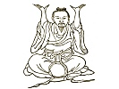
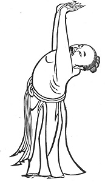

  
[Intangible Textual Heritage](../../index)  [Taoism](../index.md) 
[Index](index)  [Previous](kfu012)  [Next](kfu014.md) 

------------------------------------------------------------------------

  
*Kung-Fu, or Tauist Medical Gymnastics*, by John Dudgeon, \[1895\], at
Intangible Textual Heritage

------------------------------------------------------------------------

9.—*For the Solar Term of the Fifth Month, named "Sprouting
Seeds."*—\[Although the figure is standing, the instruction is sitting.
The sitting character \[*tso*\] seems, however, to indicate the passing
a season in such exercises, just as *hsing-kung* (\#) refers to the
carrying out of the same; an expression which occurs almost invariably
in the body of the instructions, while the other (\#) forms the title or
introduction\]. The body is thrown back, both hands raised aloft as if
supporting a thing, and great force is to be used with both right and
left in raising up (the supposed weight) 5 × 7 times. Fix the breath,
the remainder as usual. To cure weakness of the loins and kidneys,
dryness in swallowing, heart and ribs painful, eyes yellow, thirst, body
hot and thighs painful,

p. 134

head and neck painful, face red, cough and expectoration upwards,
leakage downwards (diarrhœa of the lower air may mean passage of wind,
emission of semen, or diarrhœa), grief, fear (see Figure, below). It
corresponds with Amiot's No. 5, which is against pains of the heart,
leanness of exhaustion, and thirst accompanied with heat of the body.

 

------------------------------------------------------------------------

[Next: 10.—The Middle of the Fifth Month, termed 'Summer
Solstice.'](kfu014.md)
