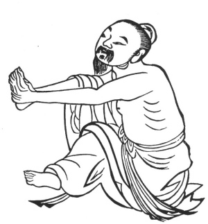

  
[Intangible Textual Heritage](../../index)  [Taoism](../index.md) 
[Index](index)  [Previous](kfu013)  [Next](kfu015.md) 

------------------------------------------------------------------------

  
*Kung-Fu, or Tauist Medical Gymnastics*, by John Dudgeon, \[1895\], at
Intangible Textual Heritage

------------------------------------------------------------------------

p. 135

10.—*The Middle of the Fifth Month, termed "Summer Solstice."*—Kneel,
stretch the hands, interlock the fingers and bend them over the foot,
change the feet right and left each 5 × 7 times, etc. To cure the
obstructed wind and damp not dispersed (rheumatism), painful knees,
ankles, and arms, palms hot and painful, kidneys, loins and spine
painful, heaviness of the body, all sorts of pain. (*See* Figure).
Corresponds with Amiot's No. II, which is directed against pains of the
knees, embarrassments of the kidneys, and the swelling of weakness.

 

------------------------------------------------------------------------

[Next: 11.—For the Solar Term of the Sixth Month, named 'Slight
Heat.'](kfu015.md)
