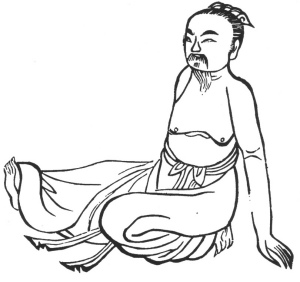

  
[Intangible Textual Heritage](../../index)  [Taoism](../index.md) 
[Index](index)  [Previous](kfu014)  [Next](kfu016.md) 

------------------------------------------------------------------------

  
*Kung-Fu, or Tauist Medical Gymnastics*, by John Dudgeon, \[1895\], at
Intangible Textual Heritage

------------------------------------------------------------------------

p. 136

11.—*For the Solar Term of the Sixth Month, named "Slight Heat."*—Press
the two hands to the ground, bend one foot under the body, stretch out
the other with force 3 × 5 times, etc. To cure rheumatism (wind and
dampness) of the legs, knees, thighs, and loins, fulness of the lungs
with excessive flow of phlegm, asthma, cough, pain in the middle of the
sternum, violent sneezing, abdominal distension and pain to the right of
the navel, the hands contracted (bent crooked), body heavy, hemiplegia,
loss of memory, whooping cough, prolapsus ani, weakness of wrist, joy
and anger inconstant. (*See* Figure). Corresponds with Amiot's No. 12,
against paralysis of certain members, short and precipitate respiration,
pains of the lower belly with tension.

 

------------------------------------------------------------------------

[Next: 12.—For the Middle of the Sixth Month, termed 'Great
Heat.'](kfu016.md)
