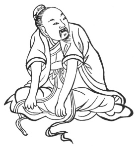
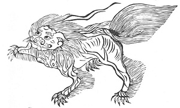

  
[Intangible Textual Heritage](../../index)  [Taoism](../index) 
[Index](index)  [Previous](kfu015)  [Next](kfu017) 

------------------------------------------------------------------------

  
*Kung-Fu, or Tauist Medical Gymnastics*, by John Dudgeon, \[1895\], at
Intangible Textual Heritage

------------------------------------------------------------------------

p. 137

12.—*For the Middle of the Sixth Month, termed "Great Heat."*—Sit all in
a heap on the [ground](errata.htm#5), twist the head toward the
shoulders, and look like a tiger to the right and left each 3 × 5 times,
etc. To cure rheumatism of the head, neck, chest, and back, cough and
asthma, thirst, dulness (taking pleasure in nothing), fulness of chest,
pain of the arm, palms of the hands hot, pain above the navel or the
shoulder and back, cold and hot perspiration, frequent micturition,
diarrhœa, skin anæsthetic, inclination to grief and crying. (See
Figure).

 

p. 138

For the last half of the Sixth Mouth, the *kung-fu* is sit quite
straight, extend the fingers upwards, bend them backwards, perform this
3 times, then bending them to the front in the same way in front and
behind alike. To cure the loins, spine, feet and knees of paraplegic
wind, and to disperse the vicious air of the bladder.

The spleen is called "Constantly Present;" designation, the "Soul's
Residence;"—in form, phoenix like. It secretes the soul, resembles an
upturned basin, colour like white reflected on yellow, covers the centre
above the navel, in front covers horizontally the stomach, its pulse
issues out of the side of the end of the big toe of the left foot just
at the corner of the nail, distant about the breadth of the leaf of the
*chiu-ts‘ai* (allium tuberosum). (See illustration).

 

p. 139

During the Sixth Month, the following exercise is given as directing
into the right courses. Extend one foot, bring both hands to the front,
and let them draw the feet 3 × 5 times. Also kneeling, both hands
grasping the earth, turn the head and look, using force and looking like
a tiger 3 × 5 times. This exercise can drive away the rheumatism which
obstructs the spleen, and promotes digestion.

The tiger appears as the illustration of the lungs in the hung beginning
the Autumnal three months. Its spirit's name is "Truly Beautiful," and
its designation "Empty Completeness." It is like a tiger, and secretes
the soul. It resembles the suspended bell (*ching*) of the Buddhists;
its colour is like white reflected on red; it is placed above the heart,
opposite the chest, and is of lobes. Its pulse issues from the inside of
the end of the thumb of the left hand, distant from the nail over two
*fên*, in the middle of the hollow there. (See illustration).

 

The *kung* for the Seventh, Eighth, and Ninth Months is with both hands
to grasp the ground, contract the body, bend the spine, raise the body 3
times, to disperse the vicious wind of the lungs and the old injuries
that are there collected. Also turn the fist and beat the back with the
left and

p. 140

right hands each 3 times, to drive out the enclosed; poisonous air in
the thorax; and, after having done this for a long time, shut the eyes,
knock the teeth, and rise.

------------------------------------------------------------------------

[Next: 13.—For the Solar Term of the Seventh Month, called 'Beginning of
Autumn.'](kfu017)
