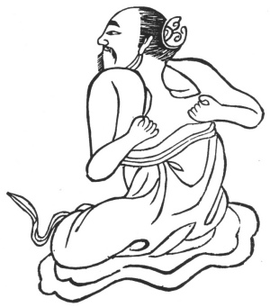

  
[Intangible Textual Heritage](../../index)  [Taoism](../index.md) 
[Index](index)  [Previous](kfu017)  [Next](kfu019.md) 

------------------------------------------------------------------------

  
*Kung-Fu, or Tauist Medical Gymnastics*, by John Dudgeon, \[1895\], at
Intangible Textual Heritage

------------------------------------------------------------------------

p. 141

14.—*For the Middle of the Seventh Month, termed "Stopping of
Heat."*—Turn the head to the right and left, raise the head, turn the
two hands and beat the back each 5 × 7 times, etc. To cure rheumatism,
pain of the shoulder, back, chest, ribs, thighs, knees, small blood
vessels, outside of the leg and ankle, pain of the various joints,
cough, asthma, shortness of breath, thirst,—all will then disappear.
(See Figure).

 

------------------------------------------------------------------------

[Next: 15.—For the Solar Term of the Eighth Month, termed 'White
Dew.'](kfu019.md)
