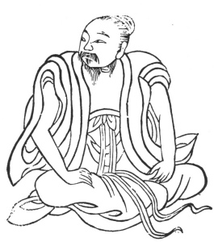

  
[Intangible Textual Heritage](../../index)  [Taoism](../index) 
[Index](index)  [Previous](kfu018)  [Next](kfu020) 

------------------------------------------------------------------------

  
*Kung-Fu, or Tauist Medical Gymnastics*, by John Dudgeon, \[1895\], at
Intangible Textual Heritage

------------------------------------------------------------------------

p. 142

15.—*For the Solar Term of the Eighth Month, termed "White Dew."*—Seated
upright press the two hands on the knees, turn the head, pushing and
stretching it each 3 × 5 times, etc. To cure rheumatism of the loins and
back, aguishness, epistaxis, lips deepened in colour, neck swollen,
aphasia from disease of the pharynx, face of a dark colour, retching,
inclination to sing and desire to ascend high places, eager to cast off
clothes and go about naked (insanity). (See Figure).

 

------------------------------------------------------------------------

[Next: 16.—Middle of the Eighth Month, named 'Autumnal
Equinox.'](kfu020)
