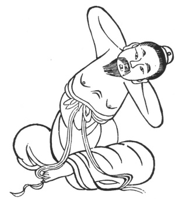

  
[Intangible Textual Heritage](../../index)  [Taoism](../index.md) 
[Index](index)  [Previous](kfu020)  [Next](kfu022.md) 

------------------------------------------------------------------------

  
*Kung-Fu, or Tauist Medical Gymnastics*, by John Dudgeon, \[1895\], at
Intangible Textual Heritage

------------------------------------------------------------------------

 

17.—*For the Solar Term of the Ninth Month, called "Cold Dew."*—Sitting
upright raise both arms, jerk up the body as if supporting something,
right and left 5 × 7 times,

p. 144

etc. To cure all sorts of vicious wind, cold, and damp, pain of the
ribs, head, neck, loins, and spine, head-ache, eyes as if falling out,
neck as if being pulled out, hæmorrhoids, fistulæ in ano, insanity, head
painful on both sides, frontal pain and also pain of vertex, yellowness
of eyes, polypus, epistaxis, cholera, and such like. (See Figure).

------------------------------------------------------------------------

[Next: 18.—Middle of the Ninth Month, termed 'Frosts Descent.'](kfu022.md)
