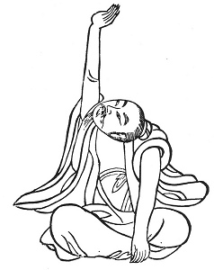

  
[Intangible Textual Heritage](../../index)  [Taoism](../index) 
[Index](index)  [Previous](kfu026)  [Next](kfu028) 

------------------------------------------------------------------------

  
*Kung-Fu, or Tauist Medical Gymnastics*, by John Dudgeon, \[1895\], at
Intangible Textual Heritage

------------------------------------------------------------------------

 

23.—*For the Solar Term of the [Twelfth](errata.htm#8) Month, named
"Slight Cold."*—Sitting upright, one hand pressing the foot,

p. 151

the other raised aloft as if supporting something, turn the head and
change alternately \[the hands\], use great force 3 × 5 times, etc. To
cure the air stored up in the arteries and veins, retching and vomiting,
stomach painful, abdomen distended, ague, fulness of thorax, failing
appetite, sighing, great heaviness of body, grief, below the heart
painful, diarrhœa, suppression of urine, jaundice, the five diarrhœas of
five colours, large and small "convenience"

 

p. 152

impervious, face yellow, mouth dry, indolent, desire to lie down, angina
pectoris, hungry, liking savoury things, want of appetite. (See Figure).

------------------------------------------------------------------------

[Next: 24. For the Middle of the Twelfth Month, termed 'Great
Cold.'](kfu028)
