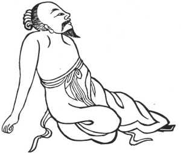

  
[Intangible Textual Heritage](../../index)  [Taoism](../index.md) 
[Index](index)  [Previous](kfu027)  [Next](kfu029.md) 

------------------------------------------------------------------------

  
*Kung-Fu, or Tauist Medical Gymnastics*, by John Dudgeon, \[1895\], at
Intangible Textual Heritage

------------------------------------------------------------------------

24\. *For the Middle of the [Twelfth](errata.htm#9.md) Month, termed "Great
Cold."*—Both hands thrown behind, sitting kneeling with one foot
extended straight out, with one foot use force right and left
alternately each 3 × 5 times, etc. To cure the storage of all sorts of
influences in the small net-work of blood-vessels, the root of the
tongue hard, painful and unable to be moved, inability to move the body
or to lie down, unable to stand great expenditure of strength, thighs
and ham space swollen, the pelvis, thighs, legs, feet and back painful,
distension of abdomen, rumbling in the intestines, food indigested
causing diarrhœa, feet unable to be pulled together in order to walk,
the nine openings impervious. (See Figure).

 

------------------------------------------------------------------------

[Next: No. 1—The Honourable and Real Form of the Great Pure Ancestral
Teacher](kfu029.md)
