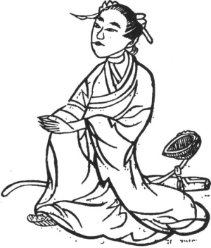

  
[Intangible Textual Heritage](../../index)  [Taoism](../index.md) 
[Index](index)  [Previous](kfu032)  [Next](kfu034.md) 

------------------------------------------------------------------------

  
*Kung-Fu, or Tauist Medical Gymnastics*, by John Dudgeon, \[1895\], at
Intangible Textual Heritage

------------------------------------------------------------------------

No. 5.—The Maiden Immortal Ho (\#) slowly ascending to Heaven.—To cure
gravel twisting the intestines and abdominal pain.

In one work, the Figure—a male—is termed "The Eighty-one (9 × 9) Ways of
ascending to Heaven."

 

p. 159

Sit inclined, the two hands embracing the knees on a level with the
navel, tread up and down with the right and left feet 9 times, move the
air round with 24 mouthfuls.

This Maiden is one of the Eight Genii. When born, six hairs were seen
growing on the crown of her head. At fourteen she dreamed that a spirit
gave her instruction in the art of procuring immortality, in the
obtaining of which she was to eat powdered mother-o’-pearl. She vowed
herself to a life of virginity, wandered in the mountains, lived on
herbs, and ultimately disappeared from mortal view. She has since, it is
said, been twice seen.

The Salt Soup (Water) Method for bringing on Vomiting.

*Prescription*.—Use very much salted water to cause vomiting and the
affection is cured.

This corresponds with Amiot's No. 19, which is there said to be against
calculus and nephritic colic.

------------------------------------------------------------------------

[Next: No. 6.—Pai Yü-ch‘an seizing his Food like the Tiger](kfu034.md)

