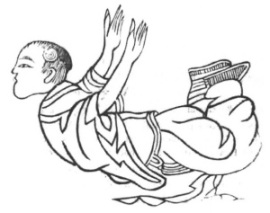

  
[Intangible Textual Heritage](../../index)  [Taoism](../index.md) 
[Index](index)  [Previous](kfu033)  [Next](kfu035.md) 

------------------------------------------------------------------------

  
*Kung-Fu, or Tauist Medical Gymnastics*, by John Dudgeon, \[1895\], at
Intangible Textual Heritage

------------------------------------------------------------------------

No. 6.—Pai Yü-ch‘an (\#) seizing his Food like the Tiger.—To cure
twisting intestinal gravel.

This Figure is elsewhere termed—The Hungry Tiger seizing his Food.

 

p. 160

The abdomen to the ground, the hands and feet with force to be turned
upwards, move the air in 12 mouthfuls, and move the hands and feet right
and left 3 × 5 times. Then sit up erect firmly, make the air advance by
this *kung* in some 14 mouthfuls. (See Figure 6).

This corresponds with Amiot's No. 15, which is against gravel and sand
in the kidneys; and he adds—"People speak well of its effects and
cures."

*Prescription*.—Take red earth and alum, of each 5 mace; powder, use one
bowl of cold water, mix, allow it to settle, and then drink.

------------------------------------------------------------------------

[Next: No. 7.—Han Chung-li's Method of sounding the Heavenly
Drum](kfu035.md)

