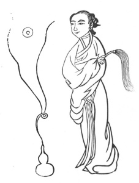

  
[Intangible Textual Heritage](../../index)  [Taoism](../index.md) 
[Index](index)  [Previous](kfu035)  [Next](kfu037.md) 

------------------------------------------------------------------------

  
*Kung-Fu, or Tauist Medical Gymnastics*, by John Dudgeon, \[1895\], at
Intangible Textual Heritage

------------------------------------------------------------------------

p. 161

No. 8.—The Immortal Maiden Ts’ao (\#) looking at the Figure of the
Ultimate Principle of Being (\#).—To cure inflammation, pain and
swelling of the eyes.

 

p. 162

Fix the tongue on the palate, direct the eyes to the vertex and nose
\[alternately\], cause the fire of the heart to descend to and enter the
*yung-chuen* (acupuncture aperture in the centre of the sole of the
foot), draw up the kidney water (semen) to the *kw’ên-lun*. In
performing it, do it 3 times each time; set it on fire in 36 mouthfuls.

The Bright Eye Flowing Air Potion.

*Prescription*.—Tang-kwei (\#), Ligusticum acutilobum, pai-shao (\#),
Pæonia albiflora, shêng-ti (\#) Rehmannia glutinosa, lung-tan-ts‘ao
(\#), Gentiana scabra, ch‘ai-hu (\#), Bupleurum falcatum, hwang-lien
(\#), rhizome of Coptis teeth, chih-tse (\#), Gardenia florida, tan-p’i
(\#), root bark of Pæonia montan;—of each 1 mace. Take of rhubarb boiled
in wine, dried and again boiled and dried 3 × 7 times, 2 mace; and make
a decoction and drink.

------------------------------------------------------------------------

[Next: No. 9.—Ch‘ieu Ch’ang-ch‘un’s Method of Turning the
Windlass](kfu037.md)

