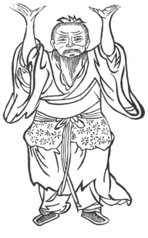

  
[Intangible Textual Heritage](../../index)  [Taoism](../index) 
[Index](index)  [Previous](kfu038)  [Next](kfu040) 

------------------------------------------------------------------------

  
*Kung-Fu, or Tauist Medical Gymnastics*, by John Dudgeon, \[1895\], at
Intangible Textual Heritage

------------------------------------------------------------------------

No. 11.—Chang Tze-yung (\#) driving the Pestle.—To cure indigestion,
distension and rumbling of the abdomen, with pain each time.

 

p. 164

Stand firmly, with the two hands support heaven, stamp the earth, and
circulate the air 9 times.

This Figure corresponds with Amiot's No. 20, against intestinal
movements and disquiet in the whole body.

The Soup for widening the Middle (Thorax).

*Prescription*.—Take of tzŭ-su, kêng-yeh (\#), Hemiptelea Davidi
(Zelkora Davidi), cardamons, chih-ch‘ioh, ch‘ing-p’i (\#), immature
fruits (dried) of a species of citrus, orange peel, betel-nut, mu-hsiang
(\#), root of Aplotaxis auriculata (putchuck), pan-hsia, lo-fu-tse,
hou-p‘o (\#), flowers of the Szechuen hou-p‘o-tzŭ, ts‘ang-shu, tsĕ-hsieh
(\#), Alisma plantago, mu-t’ung (\#), Clematis, of each the same; crude
ginger, 2 slices boiled in water.

------------------------------------------------------------------------

[Next: No. 12.—Miss Huang-hua Sleeping on Ice](kfu040)

