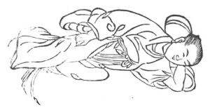

  
[Intangible Textual Heritage](../../index)  [Taoism](../index) 
[Index](index)  [Previous](kfu039)  [Next](kfu041) 

------------------------------------------------------------------------

  
*Kung-Fu, or Tauist Medical Gymnastics*, by John Dudgeon, \[1895\], at
Intangible Textual Heritage

------------------------------------------------------------------------

No. 12.—Miss Huang-hua (\#) Sleeping on Ice.—To cure consumption and
extreme debility from venereal excesses.

 

p. 165

Lie with the left hand for a pillow, rub the abdomen with the right
fist, flex the right foot a little, press the right leg upon the left a
little, and as if sleeping in this manner inspire 32 mouthfuls, and move
the air round in 12 mouthfuls.

The Soup of the Great Shop for strengthening the Centre (Thorax).

*Prescription*.—Take of ginseng, pai-shu, fu-ling, pai-shao, shu-ti
\[see shêng-ti\] (\#), hwang-ch‘i, of each 1 mace; tang-kwei,
chw‘an-hiung, tu-chung (\#), bark of an Euphorbiaceous tree, ts‘ung-jung
(\#), Æginetia Sp., ku-chï (\#), legumes of Psoralea (Bauchee seeds), of
each 7 candareens; liquorice, cinnamon, of each 3 candareens. Boil with
ginger and jujubes, and take it at any time.

------------------------------------------------------------------------

[Next: No. 13.—Yin Ching-ho's Sleeping Plan](kfu041)

