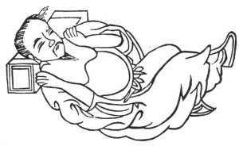

  
[Intangible Textual Heritage](../../index)  [Taoism](../index.md) 
[Index](index)  [Previous](kfu040)  [Next](kfu042.md) 

------------------------------------------------------------------------

  
*Kung-Fu, or Tauist Medical Gymnastics*, by John Dudgeon, \[1895\], at
Intangible Textual Heritage

------------------------------------------------------------------------

No. 13.—Yin Ching-ho's (\#) Sleeping Plan.—To cure weakness of the
spleen and stomach, and indigestion of the five cereals (hemp-seed,
millet, rice, wheat and pulse).

 

Recline on the back, place the right foot like a frame on the left foot,
lay the two hands straight on the shoulders, the abdomen coming and
going; move the air round in 6 mouthfuls.

p. 166

The Strong Spleen Pills.

*Prescription*.—Take of pai-shu (roasted with earth), chih-shih (\#)
roasted, Aegle sepiaria (small fruit), orange peel, mai-ya (\#) roasted,
sprouts of wheat and barley, shen-ch’ü (roasted), shan-yao (\#),
Dioscorea Sp. (yams), fn-ling, ts‘ang-shu (roasted), of each t ounce;
hou-p‘o (prepared) 8 mace; mu-hsiang 5 mace. Powder, take non-glutinous
rice flour and make into a paste and form pills, of which 6 or 7 for a
dose in rice gruel.

------------------------------------------------------------------------

[Next: No. 14.—Li Ch‘i-ch‘an’s Method of dispersing the Semen](kfu042.md)

