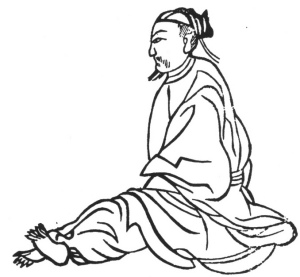

  
[Intangible Textual Heritage](../../index)  [Taoism](../index) 
[Index](index)  [Previous](kfu041)  [Next](kfu043) 

------------------------------------------------------------------------

  
*Kung-Fu, or Tauist Medical Gymnastics*, by John Dudgeon, \[1895\], at
Intangible Textual Heritage

------------------------------------------------------------------------

No. 14.—Li Ch‘i-ch‘an’s (\#) Method of dispersing the Semen (\#)
\[ching\]; sometimes called Lü-tsu's Method for strengthening the
same.—To cure spermatorrhœa from dreams.

 

Sit upright, raise up both feet, rub until warm the soles of both feet,
and move the air right and left each in 30 mouthfuls, and so the semen
will not flow away. The Chinese believe that the *ching* is secreted in
the kidneys and can be dispersed throughout the entire body, and thus be
prevented from collecting and flowing away.

p. 167

The Strong Ching Pills.

*Prescription*.—Take of chih-mu (roasted), hwang-po (\#), Phellodendron
amurense or Pterocarpus flavus, of each 1 ounce; burnt oyster shells,
burnt fossil bones, tz‘u-shih (\#), Euryale ferox, lien jui stamens of
lotus flowers, fu-ling, yuen-chih (\#), root and root bark of Polygala
sibirica, shan-chu-yü (\#) fruit of a shrub not yet identified,—of each
2 ounces. Powder boiled rice, make the pills with a cinnabar coating.
Dose, 50 pills on an empty heart (stomach), and swallow with diluted
salted water.

------------------------------------------------------------------------

[Next: No. 15.—The Maiden Chang Chên-nü fixing her Animal
Spirits](kfu043)

