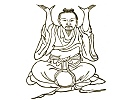

  
[Intangible Textual Heritage](../../index)  [Taoism](../index) 
[Index](index)  [Previous](kfu048)  [Next](kfu050) 

------------------------------------------------------------------------

  
*Kung-Fu, or Tauist Medical Gymnastics*, by John Dudgeon, \[1895\], at
Intangible Textual Heritage

------------------------------------------------------------------------

No. 21.—The Picture of Chang Kwo-lao [\*](#fn_9)
abstracting from and adding to the strength of Fire. (\#).—To cure the
heat of the blood of the Three Divisions (imaginary functional passages)
advancing upwards, vision indistinct.

Sit upright, let the hands rub the navel warm, afterwards press the
knees, shut the mouth, sit quiet and wait till the air is fixed, then
revolve the air in 9 mouthfuls.

p. 173

The Chrysanthemum Powder.

*Prescription*.—Take of ch‘iang-hwo, mu-tsei (\#), Equisetum japonicum,
hwang-lien, chw‘an-hiung, ching-chieh, (\#), Salvia plebeia, fang-fêng,
tang-kwei, pai-shao, liquorice, kan-chü-hua (\#), Chrysanthemum sinense
(sweet), a kind exported from Canton, man-ching-tse (\#), hwang-ch‘in
(\#), Scutellaria viscidula,—of each the same. Make a decoction, to be
taken after food.

The illustration is similar to Numbers 2, 9, 10, 16.

------------------------------------------------------------------------

### Footnotes

[172:\*](kfu049.htm#fr_9) One of the Eight
Immortals of the Tauists, who flourished toward the close of the 7th and
middle of the 8th century. He led an erratic life and performed
wonderful feats of necromancy. Mayers informs us that he had a white
mule as his constant companion, which carried him thousands of miles in
a day, and which, when he halted, he folded up and hid away in his
wallet. By spirting water from his mouth upon the packet, the beast
again resumed its proper shape. He was asked to Court, but the ascetic
wanderer spurned every tempting offer.

------------------------------------------------------------------------

[Next: No. 22.—Ch’ên’s kung for obtaining his Great Sleep](kfu050)

