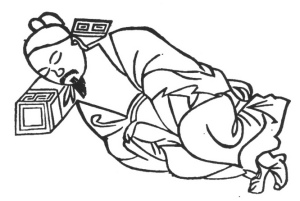
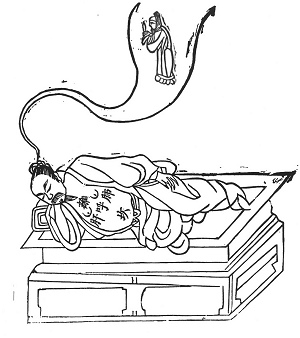

  
[Intangible Textual Heritage](../../index)  [Taoism](../index.md) 
[Index](index)  [Previous](kfu049)  [Next](kfu051.md) 

------------------------------------------------------------------------

  
*Kung-Fu, or Tauist Medical Gymnastics*, by John Dudgeon, \[1895\], at
Intangible Textual Heritage

------------------------------------------------------------------------

No. 22.—Ch’ên’s *kung* for obtaining his Great Sleep.—To cure cold
caught at any of the Four Seasons. [\*](#fn_10.md)

 

Lie on one side, flex the legs, rub the two hands until warm, embrace
the membrum virile and scrotum, and revolve the air in 24 mouthfuls.

The Ch'iang-hwo (acting) like a Divine Powder.

p. 174

 

p. 175

p. 176

*Prescription*.—Take of ch‘iang-hwo, to-hwo, pai-chïh, orange peel,
tzŭ-su, shah-cha, ts‘ao-kwo, fang-fêng, kan-ko (\#), Pachyrhizus
angulatus, pan-hsia, liquorice, ts‘ang-shu, ch‘ai-hu, hwang-ch‘in,
chw‘an-hiung,—of each 8 candareens; ginger 3 slices, and 3 onion tubers.
Make a decoction, and take it hot, to produce perspiration.

------------------------------------------------------------------------

### Footnotes

[173:\*](kfu050.htm#fr_10.md) p. 175 One of the most frequently occurring names
in the works on Kung-fu is Ch‘ĕn Hsi-i, or tw‘an (\#), and who seems to
have designed many of the Figures for the cure or prevention of disease.
The year's Kung-fu is attributed to him. He died about 990 A.D. He was a
celebrated Tauist philosopher and recluse, who devoted himself to the
study of the arts of sublimation and the occult philosophy of the *Yih
Ching*. He is recognised, as the late lamented and rare sinologue Mr.
Mayers says, by Chu Hi as having founded the modern school of
interpretation of the system of the diagrams. He was summoned to court
of the second Emperor of the Sung dynasty, for the purpose of
instructing the Emperor in the mysteries of the arts of sublimation and
the occult philosophy of the Book of Changes. The designation by which
he is known was conferred upon him by the Emperor. All the works on
Kung-fu contain his celebrated Sleeping Recipes. Hence perhaps the
popular fable that he slept 800 years. Although he appeared in the Sung
dynasty, he is said to have been born in the Chow (1122–249 B.C.). He
certainly passed much of his time in meditation, in the exercise of
Kung-fu, and this too perhaps may have given rise to the tradition of
his long sleep. The popular tradition also asserts that he did not speak
till he was seven years old. He lived in a cave at Hwa-shan in Shansi;
his bones were buried by order of Kanghi, the Emperor (1662–1723 A.D.),
the poor Tauists priest having used his skull for about 1000 years as an
object with which to extract alms from the benevolent, the use to which
it was put resembling the "wooden fish," a skull-shaped block, the
emblem of sleeplessness, on which the [priests](errata.htm#10.md) beat time
when chanting.

There are illustrations of Ch’ên sleeping on the left and right sides in
two of the works consulted. It is accompanied by two poetical stanzas,
the last line of the left sleeping hung running thus*:—*

When the tiger and the dragon are collected together at two of the
"Earthly Branches" (related to fire and water), the Great Elixir is
complete.

The tiger is here placed on the right, the dragon on the left. In the
sleeping exercise for the right side (see illustration), the liver
occupies the right and the lungs the left side, with two of the Eight
Diagram figures, *Li* and *K‘an* (fire and water respectively), above
and below, and *Hu* in the middle, and the whole stanza reads*:—*

The air of the lungs resides in the place of the *K‘an;* the liver is
directed towards the *Li* place. Revolve the air (an older work gives
spleen air instead), call it to harmonize in the middle position; the
five airs (the atmospheric influences or natures of the Five Elements)
collect together as one, and enter the great void. (See also Nos. 27 and
33).

------------------------------------------------------------------------

[Next: No. 23.—Shih Hsing-lin's Method of warming the Tan-tien](kfu051.md)

