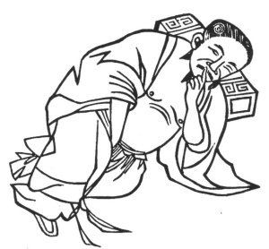

  
[Intangible Textual Heritage](../../index)  [Taoism](../index) 
[Index](index)  [Previous](kfu054)  [Next](kfu056) 

------------------------------------------------------------------------

  
*Kung-Fu, or Tauist Medical Gymnastics*, by John Dudgeon, \[1895\], at
Intangible Textual Heritage

------------------------------------------------------------------------

No. 27.—Ch’ên Hsi-i imitating the Cow descending from looking at the
Moon (\#).—To cure spermatorrhœa only.

 

When there is about to be an emission, let the middle finger of the left
hand plug the right nostril, and let the right hand middle finger press
the *wei-lü* (\#) aperture, coccyx, (where the seminal road or vessel is
supposed to be situated), and so stop the flow of the semen; revolve the
air in 6 mouthfuls.

p. 181

The *kung* is sometimes termed—A Cow grasping the Moon.

The Shên-hiung (\#) Soup.

*Prescription*.—Take of ginseng, kow-ch‘ï, yuen-chï, hwang-ch‘i,
liquorice, kwei-shên (\#) \[see tang-kwei\], tu-chung (roasted),
pai-shu, ti-kuh-p‘i (\#) root bark of Lycium chineuse, p‘o-kuh-chïh
(roasted), of each the same quantity. Add 1 slice of ginger and 7 lotus
seeds deprived of their core. Make a decoction with water, and take.

------------------------------------------------------------------------

[Next: No. 28.—Fu-yeu-ti-chün drawing the Sword from its
Scabbard](kfu056)

