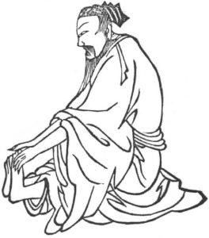

  
[Intangible Textual Heritage](../../index)  [Taoism](../index) 
[Index](index)  [Previous](kfu059)  [Next](kfu061) 

------------------------------------------------------------------------

  
*Kung-Fu, or Tauist Medical Gymnastics*, by John Dudgeon, \[1895\], at
Intangible Textual Heritage

------------------------------------------------------------------------

No. 32.—Chao Shang-tsao’s (\#) Method of transferring and stopping the
*ching*.—To cure wet dreams.

 

p. 186

Sit on one side, use the pair of hands to take hold of the soles of the
two feet, first take hold of the left sole and rub it warm, and revolve
the air 9 times. Afterwards do the same with the right sole, and perform
the kung like the left.

The Jade Pass Pills (\#); *Yü-mên* (\#),—the Jade Door, the *Ching*
Door.

*Prescription*.—Take of ginseng 6 mace; jujube kernels, roasted oyster
shells, wu-pei-tse (\#), nut-galls of Rhus semialata (commercial),
punjabenis (medicinal), roasted alum, fossil bones, of each 5 mace;
fu-shên (\#) roots and bulbs, 1 ounce; and yuen-chï (core to be
extracted), 1½ ounces. Steam the jujube kernels, and make the whole into
pills. Dose 50 to 60 on an empty stomach, to be taken in soup made from
the seeds of the lotus.

------------------------------------------------------------------------

[Next: No. 33.—The pure peaceful Heavenly Preceptor's Sleeping
Kung](kfu061)

